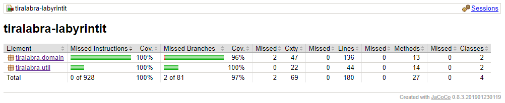

# Testikattavuusraportti
## JUnit testaus
Alla olevasta kuvasta näkyy JUnit testien testikattavuus.

### Käyttöliittymä ja Testeri-luokka
    Nämä on jätetty JUnit testeistä pois, sillä niitä ei ole syytä testata. 
    Testeri-luokassa on toteutettu tehokkuusvertailut, joten siellä olevat metodit antavat koneesta riippuen eri arvoja.
    Nämä on jätetty testikattavuusraportissa huomioimatta.
    
### Labyrintti
    Labyrintista testataan, että algorimtit tuottavat polut alusta loppuun, eli labyrintti on oikeasti mahdollista ratkaista.
    Polut on testattu useammilla eri koilla (5, 10, 20, 100), mutta tällä hetkellä testauskoko on 100.
    Tulostus- metodi on jätetty Unit testauksesta pois, mutta se on testattu monta kertaa manuaalisesti.
    Muut Labyrintti-luokan metodit on testattu kattavilla yksikkötesteillä.
    
### Ruutu
    Sama juttu kuin Labyrintti-luokassa, tulostus-metodi on testattu manuaalisesti useaan otteeseen 
    ja muut metodit on testattu kattavasti.
    
### Lista ja Pari
    Kattavat metodien yksikkötestit, ja testikattavuus näyttää näiden osalta hyvältä.
    
## Tehokkuustestit

Tehokkuutta mittasin Testeri-luokan avulla, jossa suoritan molemmat algoritmit useamman kerran samoilla syötteillä (labyrintin koko).
Labyrintin koot ovat {10, 100, 1000, 5000} (tällä hetkellä). Jokaisen koon kohdalla luon uuden labyrintin ja suoritan halutun algoritmin 10 kertaa.
Tallennan ajat taulukkoon, jonka järjestän lopussa ja valitsen lopulliseksi ajaksi taulukon mediaanin. 

Testasin pyörittää tehokkuustestit myös syötteellä 10 000, mutta wilsonin algoritmia käytettäessä overheadia tulee liikaa.

Mikäli haluat suorittaa tehokkuustestit omalla koneellasi, lisää nämä rivit main-metodiin.
>Testeri t = new Tester();
>
>t.testaaTehokkuudet();

Linkki vertailuun tulossa.
>>>>>>> 1756112a310e1733a11414cbf2691dc81d404704
