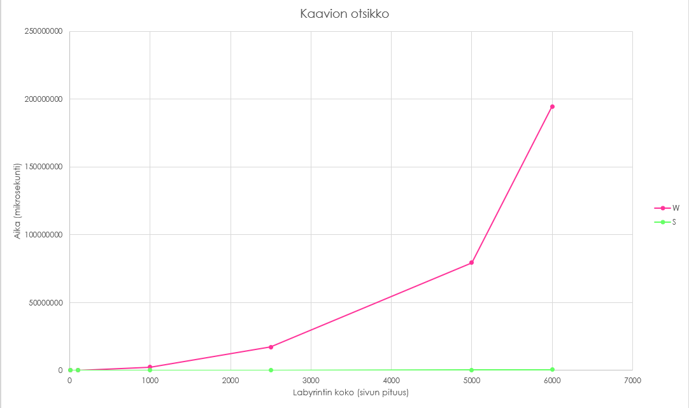
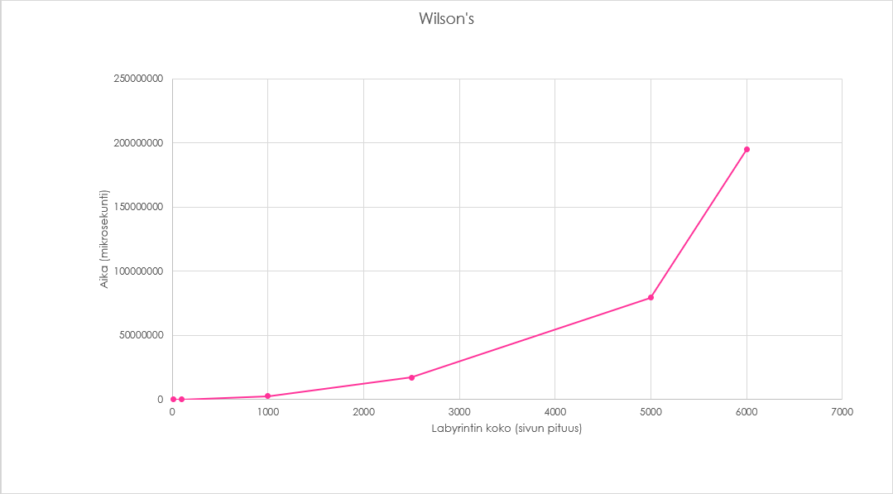
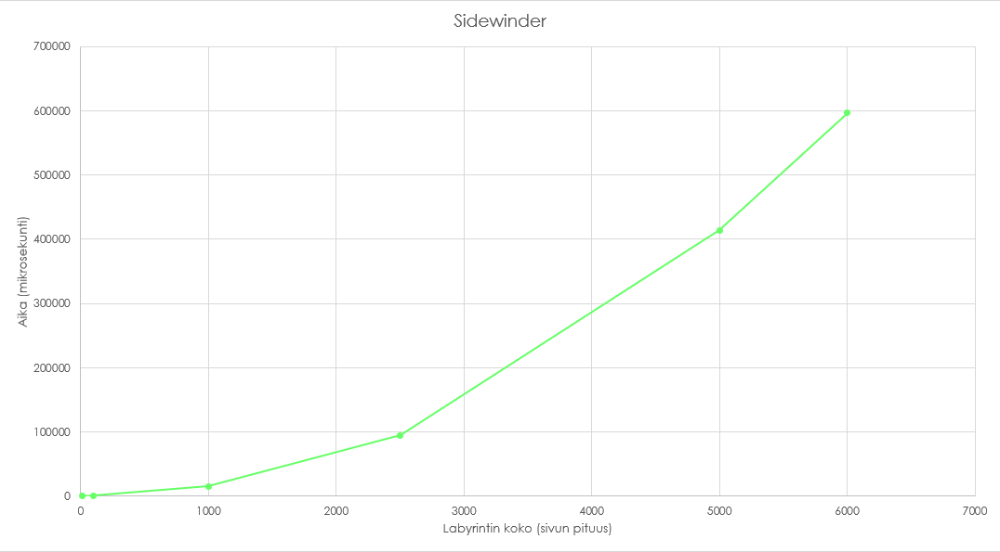
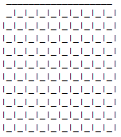
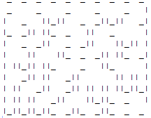
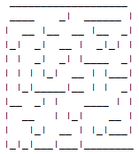

# Toteutusdokumentti

## Ohjelman yleisrakenne

Ohjelmakoodi jakautuu pakkauksiin:
```
tira.labra.labyrintit sisältää Main-luokan ja käyttöliittymän

tiralabra.domain sisältää Labyrintti- ja Ruutuluokan, jotka toteuttavat projektin toiminnallisuuden

tiralabra.util sisältää tietorakenteen Lista ja Pariluokan, joita käytetään Labyrintin algoritmien toteutuksessa. 
Tähän pakettiin kuuluu myös tehokkuustestaamiseen kuuluva luokka Testeri.
```

# Tehokkuustestit

Tehokkuutta mittasin Testeri-luokan avulla, jossa suoritan molemmat algoritmit useamman kerran samoilla syötteillä (labyrintin koko).
Labyrintin koot ovat {10, 100, 1000, 2500, 5000, 6000}. Jokaisen koon kohdalla luon uuden labyrintin ja suoritan halutun algoritmin 10 kertaa.
Tallennan ajat taulukkoon, jonka järjestän lopussa ja valitsen lopulliseksi ajaksi taulukon mediaanin. 

Testasin pyörittää tehokkuustestit myös syötteillä 10 000 ja 7000, mutta wilsonin algoritmia käytettäessä 10 000 koolla overheadia tulee liikaa ja 7000 kokoisella labyrintillä menee yli 1,5h pyörittää testit (pysäytin testit tässä vaiheessa).

Mikäli haluat suorittaa tehokkuustestit omalla koneellasi, lisää nämä rivit main-metodiin.
>Testeri t = new Tester();
>
>t.testaaTehokkuudet();

## Vertailu
    Alla olevassa taulukossa näkyy labyrinttien koot ja niiden generoimiseen kuluva aika mikrosekunteina 
    kummallakin algoritmilla. Tätä on havainnoillistettu myös alempana olevan kaavion avulla, 
    jossa wilsonin algoritmi on merkattu kirjaimella W ja sidewinder algoritmia kirjaimella S.


| Koko     | Wilsons (mikrosekunti)    | Sidewinder (mikrosekunti)|
| :--------|:---------:|:-------:|
| 10  | 255   | 6.5    |
| 100 | 12613.3 | 623.8    |
| 1000 | 2343083.5 | 15060 |
| 2500 | 17094407.6 | 94689.9 |
| 5000 | 79354534.2 | 413576.2  |
| 6000 | 194664901.3 | 596145.9  |




    Kuten taulukosta ja kaaviosta huomaa, sidewinder algoritmi on huomattavasti tehokkaampi algoritmi labyrintin 
    generoimisessa. Tämä johtuu siitä, että sidewinder joutuu käymään ainoastaan kerran jokaisen 
    labyrintin ruudun läpi luodessaan sokkeloa. Sidewinderin aikavaatimus on siis O(n^2).
    
    Wilsonin algoritmi puolestaan luo sokkelon päättömän kävelyn perusteella ja luo polkua sitä mukaa, kun se löytää jo 
    lopulliseen labyrinttiin liitetyn ruudun. Wilsonin algoritmilla voi siis periaatteessa mennä 
    äärettömän kauan aikaa luoda labyrintti, sillä se voi päättömän kävelynsä aikana käydä monta kertaa samassa ruudussa.

    Alla on vielä erikseen kaaviot molemmista algoritmeista.



    Pienimmillä koilla wilsonin algoritmi suoriutuu vielä kohtuullisen hyvin, 
    sillä todennököisyydet "kävellä" lopullisessa labyrintissä olevaan ruutuun on suuremmat. 



    Kuten jo aikaisemmin mainittiin, sidewinder käy kerran jokaisen ruudun läpi, 
    jolloin labyrintin generoimisaika ei kasva eksponentiaalisesti.


# Erot labyrinteissä

    Vertaillaan vielä labyrinttejä, joita algoritmit luovat. Kaikki labyrintit ovat 10 ruutua leveitä ja korkeita.



    Ennen algoritmin luomista labyrintti on ylläolevan kuvan mukainen; 
    jokaisella ruudulla on kaikki kolme seinää (itäinen, eteläinen ja läntinen seinä) pystyssä. 
    Valitun algoritmin suorittaminen poistaa halutut seinät sokkelon mukaan.

## Sidewinder


    
    Sidewinder algoritmi käy jokaisen ruudun labyrintissä läpi ja päättää kaivetaanko polkua ylöspäin vai oikealle. 
    Tästä syystälabyrintin ensimmäinen rivi on aina suora käytävä. 
    Toinen ongelma sidewinder algoritmin kanssa on, että se on helposti ratkaistavissa kuljettaessa alhaalta ylöspäin, 
    sillä labyrintti ei sisällä umpikujia ylöspäin kuljettaessa.

## Wilson's



    Wilsonin algoritmilla tulee paljon monipuolisempia labyrinttejä täysin erilaisen generoimistavan perusteella. 
    Silti molemmat algoritmit tuottavat ns. "täydellisiä labyrinttejä" eli kaikkiin ruutuihin pääsee kulkemaan.
